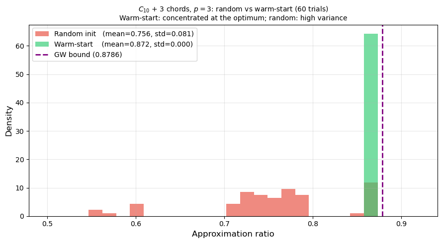

# Chapter 4 — Implementation: Circuit, Optimisation, Warm Start

This folder covers the implementation chapter: the quantum circuit that realises the QAOA ansatz, the classical optimiser that tunes its parameters, the warm-start strategy that makes multi-layer optimisation tractable, and the explicit Qiskit circuit with shot-based measurements on $C_{10}$.

| Notebook | Title | Role |
|---|---|---|
| `03_QAOA_C4_Complete_Analysis.ipynb` | $C_4$ Complete Analysis | Gate-by-gate verification on the smallest non-trivial instance |
| `04_QAOA_Optimizer_Comparison.ipynb` | Optimiser Comparison and Warm Start | Landscape behaviour at $p \geq 2$, gradients, warm-start benefit |
| `05_QAOA_QuantumCircuit.ipynb` | Quantum Circuit Construction and Measurement | Explicit Qiskit circuit on $C_{10}$ at $p = 1, 2, 3$; shot-based bitstring histograms |

---

## 1. Quantum circuit on $C_{10}$ — the ansatz

The ansatz is

$$|\psi_p(\boldsymbol\gamma, \boldsymbol\beta)\rangle = U_B(\beta_p) U_C(\gamma_p) \cdots U_B(\beta_1) U_C(\gamma_1)\, |+\rangle^{\otimes 10}$$

built from

1. **Initial state.** $|+\rangle^{\otimes 10} = H^{\otimes 10} |0\rangle^{\otimes 10}$ — one Hadamard per qubit.
2. **$p$ alternating layers** of the **problem unitary** $U_C(\gamma_k)$ and the **mixer** $U_B(\beta_k)$.

For $C_{10}$ the circuit has $n = 10$ qubits (one per vertex) and $2p$ variational parameters.

### 1.1 Problem unitary $U_C(\gamma)$

$$U_C(\gamma) = e^{-i\gamma H_C} = \prod_{(i, j) \in E} e^{-i\gamma (I - Z_i Z_j)/2}$$

Each edge factor decomposes (up to a global phase from the $I$ term) as a **CNOT–$R_Z(-\gamma)$–CNOT** block:

$$e^{i\frac{\gamma}{2} Z_i Z_j} = \text{CNOT}_{ij} \cdot (I \otimes R_Z(-\gamma))_j \cdot \text{CNOT}_{ij}$$

The identity follows from $\text{CNOT}(I \otimes Z)\text{CNOT} = Z \otimes Z$: the CNOT conjugation promotes a single-qubit $R_Z$ on the target qubit into a two-qubit $ZZ$-rotation. We verify it numerically on $C_4$ against `scipy.linalg.expm` to machine precision.

**Cost per $U_C$ layer** on a graph with $|E|$ edges: $2|E|$ CNOTs and $|E|$ $R_Z$ gates. For $C_{10}$ that is $20$ CX + $10$ $R_Z$.

### 1.2 Mixer unitary $U_B(\beta)$

Because $H_B = \sum_k X_k$ is a sum of single-qubit terms and the $X_k$ commute,

$$U_B(\beta) = e^{-i\beta H_B} = \bigotimes_{k=0}^{n-1} R_X(2\beta)_k$$

The mixer is a **product of $n$ independent single-qubit rotations** — no entangling gates. This is important for two reasons: it doesn't add CX error (relevant in Chapter 5), and it keeps the mixer cheap even as $n$ grows.

### 1.3 $C_4$ as a controlled testbed

Notebook 03 traces the $p = 1$ evolution on $C_4$ step by step at the known optimum $\gamma^* = \pi/4$, $\beta^* = \pi/8$:

- **Step 0 (initial).** Uniform superposition: all 16 amplitudes equal to $1/4$.
- **Step 1 ($U_C$).** Phases are imprinted according to $C(z)$; probabilities do **not** change yet.
- **Step 2 ($U_B$).** Interference redistributes amplitudes; the two MaxCut bitstrings $|0101\rangle$ and $|1010\rangle$ dominate the resulting distribution.

This is the cleanest single-instance demonstration that phase separation by $U_C$ plus amplitude mixing by $U_B$ concentrates probability on high-cut bitstrings. On larger graphs the mechanism is the same — the phases are more complex and require optimisation rather than closed-form parameters.

### 1.4 Explicit Qiskit construction and shot-based measurement on $C_{10}$ (Notebook 05)

Notebook 05 takes the optimal $(\gamma, \beta)$ found in Notebook 04 and writes out the explicit Qiskit circuit at $p = 1, 2, 3$:

- **Initial layer.** A Hadamard on every qubit prepares $|+\rangle^{\otimes 10}$.
- **Per layer.** $U_C(\gamma_k)$ as the product of 10 CNOT–$R_Z(-\gamma_k)$–CNOT blocks (one per edge of $C_{10}$, 20 CX + 10 $R_Z$), followed by $U_B(\beta_k)$ as 10 single-qubit $R_X(2\beta_k)$ rotations.
- **Final.** Measurement of all qubits in the computational basis.

Each circuit is transpiled at `optimization_level=1` and run on `AerSimulator` with $8192$ shots. The bitstring histograms show the predicted concentration on the two MaxCut configurations $|0101010101\rangle$ and $|1010101010\rangle$ (cut value $10$), with $p = 3$ peaking far more sharply than $p = 1$. The complementary pair $\{z, \bar z\}$ appears with nearly equal probability — a consequence of the $\mathbb{Z}_2$ symmetry of MaxCut ($C(z) = C(\bar z)$).

---

## 2. Optimisation as a hybrid loop

QAOA is a **classical–quantum hybrid** algorithm. Each iteration:

1. **Prepare** $|\psi_p(\gamma, \beta)\rangle$ on the quantum processor.
2. **Measure** $F_p = \langle H_C \rangle$ by sampling in the computational basis (on hardware) or exactly (in statevector simulation).
3. **Update** $(\gamma, \beta)$ on the classical side using $F_p$ (and, if available, its gradient).
4. **Repeat** until $|\Delta F_p| < \varepsilon$.

Only scalar cost values — not the full state — flow from the quantum processor to the classical optimiser. Gradients, when used, are built from **parameter-shift evaluations**: additional quantum evaluations of $F_p$ at shifted parameter values. No classical simulation of the quantum circuit is required.

### 2.1 Choosing the classical optimiser

Four practical choices:

| Optimiser | Gradient | Cost/step | Best for |
|---|---|---|---|
| **COBYLA** | None (trust region) | $O(p)$ | Shot-noise robust; gradient-free baseline |
| **L-BFGS-B** | Per-edge parameter-shift | $2(|E| + n) p$ | Noiseless statevector; exact gradient |
| **Nelder–Mead** | None (simplex) | $O(p)$ | Fallback when COBYLA stagnates |
| **SPSA** | Stochastic 2-evaluation | $2$ | Real hardware; shot-noisy regime |

Our primary choice is **L-BFGS-B** (fast convergence on noiseless statevector via the exact per-edge parameter-shift gradient), run in parallel with **COBYLA** (gradient-free cross-check). Two independent optimisers agreeing on the same minimum rules out solver-specific artefacts. On hardware, SPSA would replace both.

### 2.2 Parameter-shift rule — the subtle part

For a gate $e^{-i\theta G}$ whose generator $G$ has eigenvalues $\pm r$, the expectation value $F(\theta)$ is an exact sinusoid in $\theta$ and the gradient is

$$\frac{\partial F}{\partial \theta} = r \left[ F\!\left(\theta + \tfrac{\pi}{4 r}\right) - F\!\left(\theta - \tfrac{\pi}{4 r}\right) \right]$$

This is an **exact identity**, not a finite-difference approximation. For QAOA:

- **Mixer rotations** $R_X(2\beta) = e^{-i\beta X}$ have generator $X$, eigenvalues $\pm 1$, shift $\pi/2$ in $\beta$.
- **Cost rotations** $e^{i(\gamma/2) Z_i Z_j}$ have generator $Z_i Z_j$, eigenvalues $\pm 1$, shift $\pi/2$ per edge.

**Important:** $\gamma_\ell$ is a *shared* parameter across all edges in layer $\ell$. The correct gradient sums the per-edge shifts:

$$\frac{\partial F_p}{\partial \gamma_\ell} = \frac{1}{2} \sum_{(i, j) \in E} \left[ F_p(\ldots, \gamma_\ell^{(ij)} + \tfrac{\pi}{2}, \ldots) - F_p(\ldots, \gamma_\ell^{(ij)} - \tfrac{\pi}{2}, \ldots) \right]$$

A common mistake is to shift the single shared $\gamma_\ell$ by $\pi/2$ across all edges at once — this gives an incorrect gradient. Notebook 04 checks the correct formulation against finite differences and finds agreement to high precision. Per-edge parameter-shift correctness is a **prerequisite** for any optimiser comparison; the wrong formula produces a wrong search direction regardless of which solver is used downstream.

### 2.3 Shot noise

On real hardware, $F_p$ is estimated from $S$ shots with standard error $O(|E|/\sqrt S)$. This corrupts gradient estimates for gradient-based solvers (L-BFGS-B becomes unreliable below a few hundred shots) and motivates gradient-free or stochastic-gradient methods (COBYLA, SPSA) for hardware experiments. In the notebooks we use statevector simulation, so shot noise is not a limiting factor here — but it is a key reason the recommended optimiser changes between simulation and hardware.

---

## 3. Landscape geometry and barren plateaus

The QAOA objective $F_p : \mathbb R^{2p} \to \mathbb R$ is a multivariate trigonometric polynomial. Key properties:

- **Periodicity.** Each $\gamma_k$ and $\beta_k$ has a bounded fundamental domain (typically $\gamma_k \in [0, \pi]$, $\beta_k \in [0, \pi/2]$).
- **Non-convexity.** Multiple local optima appear from $p \geq 2$ onward; their number grows with $p$.
- **Gradients shrink with system size.** At fixed $p$, the variance of $\partial F_p / \partial \theta_k$ decreases as $n$ increases.

### Barren plateaus

Gradient variance can decay exponentially with $n$ on highly expressive ansätze (McClean et al. 2018), making gradient-based optimisation infeasible at large system sizes. The mathematical statement and a numerical demonstration on cycle graphs $n \in \{4, \ldots, 12\}$ live in [Theory/02 §5](../Theory/02_QAOA_Theory_Part2_Circuits_and_Landscape.ipynb). At our scale ($n \le 12$, $p \le 3$) the variance drops only as $O(1/\mathrm{poly}(n))$ and gradients are well within the trainable regime — barren plateaus are not the bottleneck for any of the optimiser comparisons in Notebook 04.

---

## 4. Warm start (Zhou et al. 2020)

Random-restart optimisation wastes evaluations exploring distant local maxima. A cheaper alternative, used throughout Chapter 5, is **layer-by-layer warm start**.

### Intuition

A $p$-layer optimum $(\gamma^*_{p}, \beta^*_{p})$ is already a good neighbourhood for $(p + 1)$ layers — adding one more layer with small $\gamma, \beta$ is nearly the identity and does not move the state far. Random restarts at $p = 3$ therefore waste evaluations on distant basins.

### Algorithm

1. Optimise $p = 1$ globally (several random restarts, cheap — only 2 parameters).
2. For $k = 2, 3, \ldots, p$:
   - Initialise $\theta_0 \gets (\gamma^*_{k-1}, \gamma^*_{k-1}[-1]) \| (\beta^*_{k-1}, \beta^*_{k-1}[-1]) + \eta$ (duplicate the last layer plus a small Gaussian perturbation $\eta$).
   - Locally optimise $F_k$ from $\theta_0$.
3. Return the final $(\gamma^*, \beta^*)$.

### Empirical benefit

On $C_{10} + 3$ chords at $p = 3$ over 20 trials:

- **Random initialisation:** COBYLA mean ratio $0.828$ (std $0.083$); L-BFGS-B mean $0.766$ (std $0.126$).
- **Warm start:** both optimisers reach $0.872$ with std $\approx 0$.

Warm start reduces both mean bias and variance — random restarts at $p = 3$ frequently get stuck in suboptimal basins that warm start avoids. There is no general theoretical guarantee; the benefit is empirical and graph-dependent.



*COBYLA and L-BFGS-B approximation ratio distributions on $C_{10} + 3$ chords, $p = 3$, 20 trials each. Warm start (green) collapses onto the GW bound; random initialisation (pink) is spread widely. Same conclusion for both optimisers.*

---

## 5. Resource summary

| Graph | $p$ | Parameters | CX gates | $R_Z$ gates | $R_X$ gates |
|---|---|---|---|---|---|
| $C_4$ | 1 | 2 | 8 | 4 | 4 |
| $C_4$ | 2 | 4 | 16 | 8 | 8 |
| $C_4$ | 3 | 6 | 24 | 12 | 12 |
| $C_{10}$ | 1 | 2 | 20 | 10 | 10 |
| $C_{10}$ | 3 | 6 | 60 | 30 | 30 |

General rule: depth $p$, graph with $|E|$ edges and $n$ vertices — $2p|E|$ CX, $p|E|$ $R_Z$, $pn$ $R_X$, $2p$ parameters.

---

## Key takeaways

1. **CNOT–$R_Z$–CNOT decomposition is exact.** Each $e^{i(\gamma/2) Z_i Z_j}$ is implemented with 2 CNOTs and 1 $R_Z$, with no approximation.
2. **Per-edge parameter-shift correctness is a prerequisite**, not a detail. A single global $\gamma$ shift gives an incorrect gradient; the correct gradient sums per-edge shifts.
3. **Optimiser choice trades convergence speed for robustness.** L-BFGS-B with per-edge parameter-shift gradients converges fastest on noiseless statevector but degrades sharply once shot noise or landscape flattening corrupts gradient estimates; COBYLA (and SPSA on hardware) accept slower convergence in exchange for surviving those regimes. The right pair for noiseless simulation is L-BFGS-B + COBYLA (exact gradient + gradient-free cross-check); SPSA is the practical choice on hardware.
4. **Warm start dominates random initialisation** at $p \geq 2$ on non-trivial graphs. On $C_{10} + 3$ chords at $p = 3$ it reduces variance effectively to zero.
5. **Barren plateaus and shot noise** are real but are not the primary obstacles at the small $n$ and low $p$ we operate in.

---

## Dependencies

```
numpy, scipy, matplotlib, networkx, qiskit, qiskit-aer
```

---

## References

- Farhi, Goldstone, Gutmann. *A quantum approximate optimization algorithm.* arXiv:1411.4028, 2014.
- Zhou et al. *Quantum approximate optimization algorithm: Performance, mechanism, and implementation on near-term devices.* Phys. Rev. X 10, 2020.
- McClean et al. *Barren plateaus in quantum neural network training landscapes.* Nature Commun. 9, 2018.
- Cerezo et al. *Cost function dependent barren plateaus in shallow parametrized quantum circuits.* Nature Commun. 12, 2021.
- Bravyi et al. *Obstacles to variational quantum optimization from symmetry protection.* arXiv:2110.14206, 2021.
