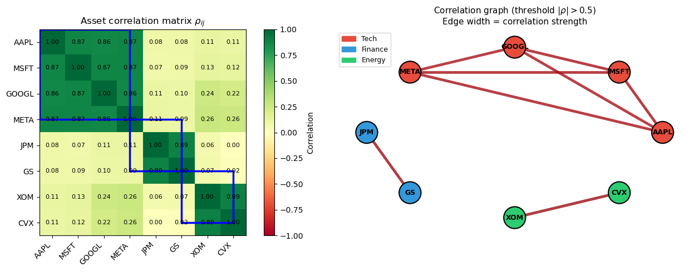

# Chapters 1 & 2 — Introduction and Motivation

This folder frames the problem class our project tackles: **QUBO problems solved on quantum hardware via Ising QAOA**, with **MaxCut** as the canonical simplest case.

| Notebook | Title |
|---|---|
| `00_Applications_and_Motivation.ipynb` | From real applications → QUBO → Ising QAOA → MaxCut |

---

## 1. Graphs and cuts

### 1.1 Definition of a graph

A graph is a pair $G = (V, E)$:

- **Vertex set** $V = \{0, 1, \ldots, n-1\}$, with $|V| = n$.
- **Edge set** $E \subseteq \binom{V}{2}$, a collection of unordered pairs.

The running example throughout the project is the 4-cycle $C_4$:

$$V = \{0, 1, 2, 3\}, \qquad E = \{\{0,1\}, \{1,2\}, \{2,3\}, \{0,3\}\}, \qquad n = 4,\ |E| = 4$$

We will also see the 10-cycle $C_{10}$, $C_{10}$ with added chords, and a random 3-regular graph on 10 vertices as the three benchmark instances.

### 1.2 Cuts and the MaxCut problem

A **cut** is a partition of the vertices into two disjoint sets $V = S \sqcup \bar S$. The **cut value** is the number of edges with one endpoint on each side:

$$C(S) = \big|\{(i, j) \in E : i \in S,\ j \in \bar S\}\big|$$

**MaxCut** asks for the partition that maximises $C(S)$.

On $C_4$: there are $2^4 = 16$ labelled partitions but only $2^3 = 8$ distinct cuts (swapping $S$ and $\bar S$ gives the same cut). The maximum value is $4$, achieved when adjacent vertices are on opposite sides — e.g. $S = \{0, 2\}$ gives $C = 4$, while $S = \{0, 1\}$ gives only $C = 2$.

### 1.3 Why it's hard

MaxCut is **NP-hard** in general (Karp 1972). Brute force enumerates $2^{n-1}$ distinct cuts; this is $\approx 10^{15}$ for a mere $n = 50$. For large instances we must accept approximation.

Stronger inapproximability results (Håstad 2001; Khot et al. 2007) say that no polynomial-time algorithm can guarantee a ratio better than $\approx 0.941$ in general, and under the Unique Games Conjecture the best-possible polynomial-time ratio is exactly the Goemans–Williamson constant $\alpha_{\text{GW}} \approx 0.8786$.

---

## 2. The QUBO Framework

### 2.1 The common skeleton

The four applications below share an identical mathematical structure:

- A set of **objects** with **pairwise relationships** and a binary **yes/no decision** for each.
- Mathematically, this is a **QUBO**:

$$\min_{x \in \{0,1\}^n}\; x^T Q x + c^T x$$

with $Q$ encoding pairwise interactions and $c$ encoding individual costs. After substituting $x_i = (1-s_i)/2$ with $s_i \in \{-1, +1\}$, the problem becomes the **Ising Hamiltonian**

$$H = \sum_{i<j} J_{ij}\,s_i s_j + \sum_i h_i\,s_i + \mathrm{const}$$

which (with $s_i \to Z_i$) is exactly the cost operator of QAOA. **No reduction tricks are needed**: this map is a one-line variable substitution, and Pauli-$Z$ fields plus $ZZ$ couplings are the native vocabulary of every major qubit platform (superconducting, trapped-ion, neutral-atom).

### 2.2 Four QUBO applications

The notebook walks through these examples:

- **Portfolio selection (Markowitz binary).** $\min x^T \Sigma x - q\,\mu^T x$ subject to a budget. QUBO with both linear (returns) and quadratic (covariance) terms. The notebook also presents a separate **risk-only partitioning** framing — pure MaxCut on the correlation graph — interpreted as a 2-cluster Hierarchical Risk Parity (López de Prado 2016) and as a long-short hedging construction.
- **Job scheduling.** Two slots, conflict graph weights $c_{ij}$. The QUBO is purely quadratic, so this maps directly onto MaxCut: $w_{ij} = c_{ij}$, no ancilla.
- **Facility location.** Open/closed decisions with values $v_i$ and pairwise overlap $o_{ij}$. QUBO with non-trivial linear field; equivalent to MaxCut on $n+1$ vertices via the §2.4 ancilla reduction.
- **Network partitioning.** Communication / traffic graphs; the meaningful problem is *minimum bisection* (plain MinCut is trivial — cut value $0$ when one side is empty). Under a balance constraint, minimum bisection of $G$ is maximum bisection of the complement graph $\bar G$; the bisection constraint is enforced via a soft penalty $\lambda(\sum_i s_i)^2$ that folds into $H_C$.

Every example lives at the QUBO level. Some happen to be pure MaxCut; others have linear fields and reduce to MaxCut only after the universality theorem.

### 2.3 Why MaxCut, then?

MaxCut is the QUBO with **no linear field** ($h_i = 0$, only $ZZ$ couplings):

$$H_C^{\text{MaxCut}} = \sum_{(i,j) \in E} w_{ij}\,\frac{I - Z_i Z_j}{2}.$$

It is the *minimum working example* of QUBO on a quantum computer. We focus on it because:

1. **Cleanest analysis.** Theoretical bounds (Farhi–Goldstone–Gutmann 2014 onward), shallowest circuits, simplest gradient computations.
2. **Standard benchmark.** Cross-paper comparability of QAOA results.
3. **Universality (next).** No generality is lost.

### 2.4 Universality: QUBO ⟺ MaxCut on $n+1$ vertices

**Theorem (Barahona 1982).** Every QUBO on $n$ binary variables is equivalent to MaxCut on a *signed-weighted* graph with $n+1$ vertices.

*Proof sketch.* Substitute $x_i = (1-s_i)/2$ to get an Ising model with fields $h_i s_i$ and couplings $J_{ij} s_i s_j$. Introduce an ancilla spin $s_0$ and write $h_i s_i = h_i s_i s_0$ (since $s_0^2 = 1$). Every term is now quadratic — a MaxCut instance on the augmented graph (original couplings $J_{ij}$ plus a star of edges of weight $h_i$ from $s_0$). ∎

**Caveat.** The reduction generally produces *signed* edge weights (couplings $J_{ij}$ keep their sign; ancilla edges have weight $h_i$ which can be either sign). This is "MaxCut on signed/weighted graphs", a strict generalisation of the unweighted-nonnegative MaxCut studied in classical approximation theory. The QAOA Hamiltonian is unaffected — it accepts any real $J_{ij}, h_i$. Classical guarantees written for nonnegative MaxCut (e.g. the $0.8786$ Goemans–Williamson bound) do not transfer verbatim to the reduced instance.

In practice we never *perform* this reduction — Ising QAOA handles general QUBO directly. The reduction is the **theoretical statement that focusing on MaxCut loses no generality**.

### 2.5 Why this is a good approach

- **Hardware-native.** Ising is what quantum hardware speaks — no encoding overhead.
- **NISQ-friendly.** Constant-depth layers, polynomial parameters, variational structure.
- **Universal.** One Hamiltonian family covers every QUBO; one MaxCut analysis covers every QUBO via Barahona.
- **Frustration ↔ quantum strength.** MaxCut is the antiferromagnetic-Ising ground state. Frustrated systems are precisely where classical heuristics struggle and where quantum methods have a hope of advantage.
- **Theoretical traction.** The cleanest QAOA performance theorems are stated for MaxCut.

---

## 3. The Portfolio Example, in Detail

**Setup.** $n$ assets with daily returns $r_i(t)$. Compute pairwise correlations $\rho_{ij} = \mathrm{Cov}(r_i, r_j)/(\sigma_i \sigma_j) \in [-1, 1]$.

**The two framings on the same data $\Sigma$:**

- **(A) Markowitz binary selection (QUBO).** Pick which $K$ assets to include: $\min x^T \Sigma x - q\,\mu^T x$ s.t. $\sum x_i = K$. Has a linear field from returns and from the budget penalty.
- **(B) Risk-only partitioning (pure MaxCut).** Partition the assets into two baskets to maximise the cut on the correlation graph. Either basket has minimised internal correlation (HRP-style diversification); long-one / short-the-other is a market-neutral hedge.

These are different problems on the same data — both useful, both reducing to QAOA on an Ising Hamiltonian.

**Worked example in the notebook.** Eight synthetic assets across three sectors (Tech, Finance, Energy) with a small market factor. Intra-sector correlations $\sim 0.87$, inter-sector $\sim 0.3$. We threshold at $|\rho_{ij}| > 0.5$ so that the resulting graph contains only the high-correlation (intra-sector) pairs, and solve (B)-MaxCut via Goemans–Williamson SDP rounding. **The MaxCut partition cuts across sector boundaries** — high-correlation sector-mates are placed in different baskets, exactly because cutting those edges is what MaxCut rewards. Each basket ends up with a mix of Tech, Finance, and Energy holdings, and the within-basket mean correlation drops well below the intra-sector $0.87$.



*Left: weighted correlation graph on 8 assets; intra-sector edges (thick) carry high weight, inter-sector edges are light. Right: the MaxCut partition cuts most of the thick edges, splitting each sector across the two baskets.*

---

## Key takeaway

The story is **QUBO → Ising → QAOA**, with MaxCut as the canonical simplest case. Every application listed here is a QUBO; QAOA optimises the corresponding Ising Hamiltonian directly on hardware; the universality theorem says studying MaxCut suffices in principle. The notebooks 01–07 carry out that study.

The reductions justify MaxCut as a unifying model; they do **not** by themselves justify QAOA over classical methods — polynomial-time GW already guarantees ratio $\geq 0.8786$, and cheap heuristics like multi-start greedy are competitive on many instances. Whether QAOA gives a practical advantage, and under what conditions, is the empirical question NB 04–07 investigate.

---

## Dependencies

```
numpy, matplotlib, networkx, cvxpy
```

---

## References

- Barahona, F. *On the computational complexity of Ising spin glass models.* J. Phys. A **15**, 3241 (1982).
- Farhi, Goldstone, Gutmann. *A Quantum Approximate Optimization Algorithm.* arXiv:1411.4028 (2014).
- Goemans, Williamson. *Improved approximation algorithms for maximum cut and satisfiability problems using semidefinite programming.* JACM **42**(6), 1995.
- Håstad, J. *Some optimal inapproximability results.* JACM **48**(4), 2001.
- Karp, R. *Reducibility among combinatorial problems.* In *Complexity of Computer Computations*, Plenum (1972).
- Khot, S., Kindler, G., Mossel, E., O'Donnell, R. *Optimal inapproximability results for MAX-CUT and other 2-variable CSPs.* JACM **54**(3), 2007.
- López de Prado, M. *Building diversified portfolios that outperform out of sample.* Journal of Portfolio Management **42**(4), 59–69 (2016).
- Lucas, A. *Ising formulations of many NP problems.* Front. Phys. **2**, 5 (2014).
