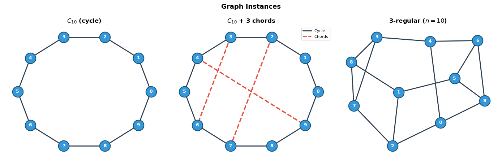
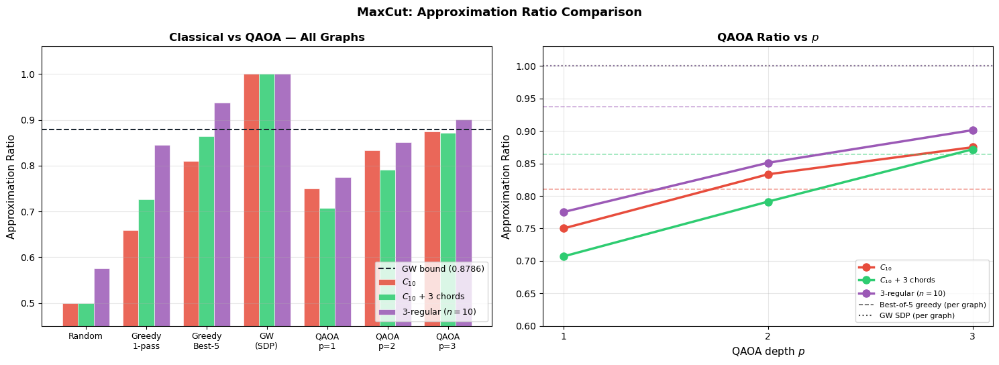
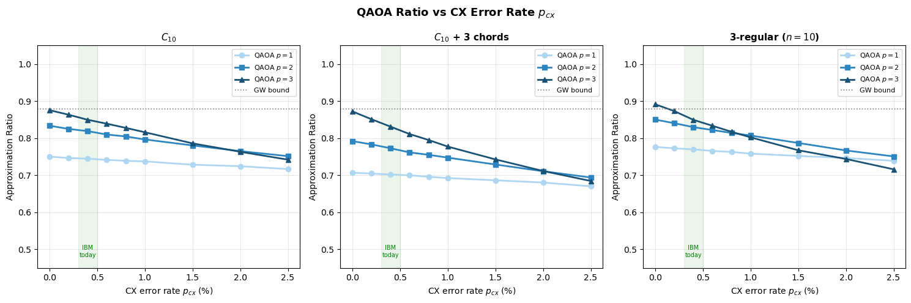

# Chapter 5 — Results

This folder contains the two experimental notebooks that benchmark QAOA against classical algorithms on three graph instances and measure how depolarizing noise degrades performance as a function of the CX error rate.

| Notebook | Title | Role |
|---|---|---|
| `06_QAOA_Experiments.ipynb` | QAOA vs Classical Baselines | Solution quality on three graphs |
| `07_QAOA_Noise.ipynb` | Noise Analysis | Depolarizing sweep, depth crossover |

(The gate-level Qiskit circuit construction and shot-based measurement histograms moved to [Implementation/05_QAOA_QuantumCircuit.ipynb](../Implementation/05_QAOA_QuantumCircuit.ipynb) — they fit better with the rest of the implementation work.)

---

## 1. Problems to solve: three graph instances

| Graph | $n$ | $|E|$ | $C_{\max}$ | Structural role |
|---|---|---|---|---|
| $C_{10}$ (cycle) | 10 | 10 | 8 | Highly regular, locally tree-like |
| $C_{10}$ + 3 chords | 10 | 13 | 10 | Long-range edges disrupt local heuristics |
| 3-regular ($n = 10$) | 10 | 15 | 13 | Degree-uniform Farhi-family instance |


*$C_{10}$ cycle (left), $C_{10}$ with 3 added chords shown as red dashed edges (centre), random 3-regular graph on 10 vertices (right).*

The three instances probe two known failure modes of shallow QAOA: locality limitations when long-range edges are present (chord graph), and the degree-regular regime where $p = 1$ theoretical bounds exist (3-regular).

---

## 2. Performance comparison

### 2.1 Methods

Four classical baselines and three QAOA depths:

- **Random assignment.** $z_i$ independently $\pm 1$ with prob. $1/2$. Expected cut $|E|/2$; ratio exactly $0.5$.
- **Greedy (single pass).** Visit vertices in random order; each joins the side that cuts more already-assigned neighbours. Guaranteed $\geq 0.5$.
- **Greedy best-of-5.** Five independent orderings; keep the best. Same asymptotic cost, much stronger in practice.
- **Goemans–Williamson (SDP).** Relax to unit vectors, solve the SDP, round by random hyperplane (200 rounds). Guaranteed ratio $\geq 0.8786$ on expectation.
- **QAOA** at $p = 1, 2, 3$ with L-BFGS-B + warm start, statevector simulation.

Results are reported as **approximation ratios** $F_p / C_{\max}$, so different graphs can be compared directly.

### 2.2 Results


*Left: approximation ratios for all methods across the three graphs; GW bound (0.8786) shown as dashed line. Right: QAOA ratio vs depth $p$, with best-of-5 greedy and GW-SDP as per-graph reference lines.*

Approximate numbers read from the chart:

| Method | $C_{10}$ | $C_{10} + 3$ | 3-regular |
|---|---|---|---|
| Random | 0.50 | 0.50 | 0.57 |
| Greedy 1-pass | 0.66 | 0.73 | 0.85 |
| Greedy best-of-5 | 0.81 | 0.86 | 0.94 |
| GW (SDP) | 1.00 | 1.00 | 1.00 |
| QAOA $p = 1$ | 0.75 | 0.71 | 0.77 |
| QAOA $p = 2$ | 0.83 | 0.79 | 0.85 |
| QAOA $p = 3$ | 0.87 | 0.87 | 0.90 |

### 2.3 Takeaways

**QAOA $p = 1$ beats Random and single-pass Greedy** on every graph, but **does not beat Greedy best-of-5** on any instance. The right classical comparison baseline is not single-pass greedy — best-of-5 greedy is much stronger and still orders of magnitude cheaper than a single QAOA evaluation.

**QAOA $p = 3$ matches or slightly exceeds Greedy best-of-5** on the chord graph (where single-pass greedy struggles most) and the 3-regular graph, but **does not match GW** on any instance.

**Monotone improvement with depth.** $p = 1 \to 2 \to 3$ increases the ratio on every graph. The gain is largest on the chord graph (0.71 → 0.87), which has non-local structure that shallow QAOA captures better than local greedy heuristics — consistent with QAOA's known locality limitation at small $p$ (Bravyi et al. 2021).

The optimal $(\gamma^*, \beta^*)$ found here at each depth are exported to `optimal_params.json` for use by Notebook 07 (noise sweep).

---

## 3. Introducing noise

### 3.1 Noise model

We apply the **two-qubit depolarizing channel** after every CX gate, with error probability $p_{cx}$:

$$\mathcal E(\rho) = (1 - p_{cx})\rho + \frac{p_{cx}}{15} \sum_{P \in \{I, X, Y, Z\}^{\otimes 2} \setminus \{I^{\otimes 2}\}} P \rho P^\dagger$$

Single-qubit gates are treated as noiseless. A depth-$p$ QAOA circuit has $2p |E|$ CX gates, so the noise budget scales linearly with both $p$ and $|E|$.

**Scope.** This model does **not** capture coherent errors, crosstalk, qubit-specific asymmetry, or readout error. Results below should be read as indicative trends on a simplified model, not hardware-calibrated predictions.

### 3.2 Experimental protocol

- Sweep $p_{cx} \in [0, 0.025]$ (i.e. 0%–2.5%).
- For each $p \in \{1, 2, 3, 4, 5\}$ and each of the three graphs.
- **Parameters held fixed at the noiseless optimum** from Notebook 06 (loaded from `optimal_params.json`). This isolates the effect of noise on circuit fidelity from re-optimisation under noise.
- Qiskit Aer statevector simulation with 4096 shots per point.

### 3.3 Ratio evolution with noise


*Approximation ratio vs CX error rate $p_{cx}$ for $p = 1, \ldots, 5$ on all three graphs. Dashed line: GW bound (0.8786). Green band: current IBM device range ($p_{cx} \approx 0.3$–$0.5\%$).*

Observations that apply across all three graphs:

- **Monotone degradation.** Ratio decreases with $p_{cx}$ for every $(p, \text{graph})$ pair.
- **Deeper circuits degrade faster.** $p = 5$ has $5\times$ the CX count of $p = 1$ and drops the fastest. At $p_{cx} = 0$ deeper is always better; at $p_{cx} = 2.5\%$ the $p = 5$ curve has fallen below $p = 1$ on $C_{10}$ and $C_{10} + 3$.
- **Crossover near $p_{cx} \approx 1\%$.** The point at which $p = 1$ first overtakes $p = 3$ sits roughly at $p_{cx} \approx 1\%$ for all three graphs (slight variation by structure).

### 3.4 Count histograms with noise

Notebook 07 also compares the bitstring count histograms on $C_{10}$ at $p_{cx} \in \{0.5\%, 2.5\%\}$, at $p = 1$ and $p = 3$:

- At $p_{cx} = 0.5\%$ (IBM-like), $p = 3$ still concentrates probability on the two MaxCut bitstrings far more effectively than $p = 1$. Losing some counts to noise, but $p = 3$ is clearly better.
- At $p_{cx} = 2.5\%$, the $p = 3$ peaks have collapsed to roughly the same height as the $p = 1$ peaks. At this error rate, the extra layers have eaten more fidelity than they have added quality.

### 3.5 Practical implication

The optimal QAOA depth on near-term hardware is **not determined by expressibility alone**. It is set by the trade-off between the quality gain from an additional layer and the fidelity loss from the extra CX gates that layer adds. For current IBM devices with $p_{cx} \approx 0.3$–$0.5\%$, the data suggests $p = 2$ or $p = 3$ is close to the useful boundary — deeper circuits stop paying off under this noise model.

---

## Conclusions

- **Depth helps, but optimisation gets harder.** Approximation ratio rises monotonically with $p$ on every graph (NB 06), yet each added layer doubles the parameter count and flattens the landscape — the limiting factor for QAOA at moderate $p$ is *finding* a good $(\boldsymbol\gamma, \boldsymbol\beta)$, not the expressivity of the ansatz itself.
- **QAOA matches but rarely beats strong classical baselines on these instances.** $p = 1$ beats Random and 1-pass Greedy but not best-of-5 Greedy or GW; $p = 3$ approaches GW on the chord graph but does not match it on any of the three graphs. The right classical baseline is best-of-5 Greedy, not single-pass.
- **Noise is the binding constraint.** Under depolarizing $p_{cx}$, ratio degrades monotonically and faster for deeper circuits; above $p_{cx} \approx 1\%$, $p = 1$ already outperforms $p = 3$ on all three graphs. Practical scalability is gated by hardware fidelity, not by the algorithm.
- **Hybrid by construction.** QAOA remains a **classical–quantum hybrid** — quantum for objective evaluation, classical for parameter update — and the classical half (optimiser, init, depth choice under noise) is what most directly determines whether the algorithm is useful.

> **One-line conclusion.** *QAOA is fundamentally limited not by expressivity, but by optimisation difficulty and noise sensitivity.*

We have **not proved a quantum advantage**, but we have not proved it is impossible either. The regime where it might appear is narrow: graph structure that classical heuristics handle poorly, enough depth to exploit non-local correlations, and hardware fidelity high enough to support that depth.

---

## Dependencies

```
numpy, scipy, matplotlib, networkx, qiskit, qiskit-aer, cvxpy
```

---

## References

- Farhi, Goldstone, Gutmann. *A quantum approximate optimization algorithm.* arXiv:1411.4028, 2014.
- Goemans, Williamson. *Improved approximation algorithms for maximum cut and satisfiability problems using semidefinite programming.* JACM 42(6), 1995.
- Khot et al. *Optimal inapproximability results for MAX-CUT and other 2-variable CSPs.* JACM 54(3), 2007.
- Bravyi et al. *Obstacles to variational quantum optimization from symmetry protection.* arXiv:2110.14206, 2021.
- Wang et al. *Noise-induced barren plateaus in variational quantum algorithms.* Nature Commun. 12, 2021.
- Zhou et al. *Quantum approximate optimization algorithm: Performance, mechanism, and implementation on near-term devices.* Phys. Rev. X 10, 2020.
