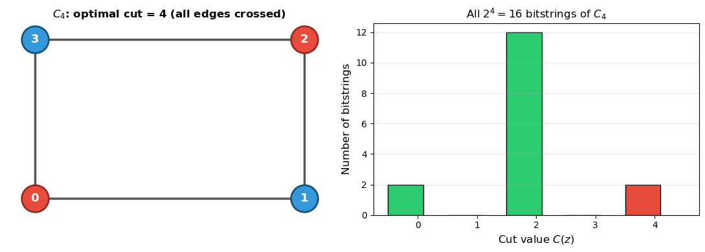
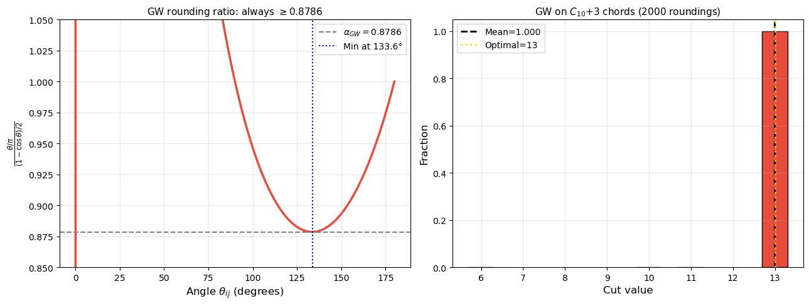

# QAOA for Maximum Cut — Theory Notebooks


This pair of notebooks builds the complete theoretical foundation for the Quantum Approximate Optimization Algorithm (QAOA) applied to Maximum Cut, starting from the combinatorial problem and ending with a precise characterisation of why optimisation is difficult.

---

## Notebook Overview

| Notebook | Title | Contents |
|---|---|---|
| `01_QAOA_Theory_Part1_Hamiltonian.ipynb` | From Combinatorial Problem to Quantum Hamiltonian | MaxCut → Ising → H_C → QAOA ansatz |
| `02_QAOA_Theory_Part2_Circuits_and_Landscape.ipynb` | Classical Algorithms, Gate Decomposition, and Landscape Geometry | GW baseline → gate decomposition → barren plateaus → error budget |

---

## Part I — From Combinatorial Problem to Quantum Hamiltonian

### 1. MaxCut: Combinatorial Formulation

Given an undirected graph $G = (V, E)$ with $|V| = n$, the MaxCut problem asks for a partition $(S, \bar{S})$ of $V$ that maximises the number of crossing edges:

$$\text{MaxCut}(G) = \max_{S \subseteq V} \sum_{(i,j) \in E} \mathbf{1}[i \in S,\ j \notin S]$$

Assigning binary variables $z_i \in \{0,1\}$ (with $z_i = 0 \Leftrightarrow i \in S$), the indicator for edge $(i,j)$ being cut is:

$$\mathbf{1}[z_i \neq z_j] = z_i + z_j - 2z_iz_j = \frac{1 - (-1)^{z_i + z_j}}{2}$$

The total cut value is $C(z) = \sum_{(i,j) \in E} \mathbf{1}[z_i \neq z_j]$. MaxCut is NP-hard in general (Karp 1972), so the classical polynomial-time algorithms in Part II all produce approximations.

The running example throughout is the 4-cycle $C_4$, which has optimal cut value 4 (all edges crossing), achieved by any 2-coloring of the cycle.


*$C_4$ with its optimal 2-coloring (left) and the corresponding bitstring-to-cut-value mapping (right). Red nodes $\{0,2\}$ and blue nodes $\{1,3\}$ form the two partition sides; all 4 edges cross the cut.*

### 2. Classical Ising Encoding

The **Ising model** on $G$ assigns spin variables $s_i \in \{-1, +1\}$ to each vertex. Under the substitution $s_i = 1 - 2z_i$ (so $z_i = 0 \Rightarrow s_i = +1$, $z_i = 1 \Rightarrow s_i = -1$), an edge $(i,j)$ is cut if and only if $s_is_j = -1$:

$$C(s) = \sum_{(i,j) \in E} \frac{1 - s_is_j}{2}$$

Maximising $C(s)$ is equivalent to minimising the antiferromagnetic Ising energy $-\sum_{(i,j)} J_{ij}\, s_is_j$ with $J_{ij} = -1$. This equivalence is the bridge from combinatorics to physics.

### 3. Quantum Hamiltonian via Pauli-Z

Each qubit $i$ carries a Pauli-Z operator

$$Z_i = \begin{pmatrix}1 & 0 \\ 0 & -1\end{pmatrix}_i \otimes I_{\text{rest}}$$

which acts on the computational basis as $Z_i|z\rangle = (-1)^{z_i}|z\rangle = s_i|z\rangle$. Replacing $s_i \to Z_i$ is therefore exact on all basis states simultaneously. The **cost Hamiltonian** is:

$$\boxed{H_C = \sum_{(i,j) \in E} \frac{I - Z_iZ_j}{2}}$$

$H_C$ is diagonal in the computational basis; its $(z,z)$ diagonal entry is exactly $C(z)$. Maximising $\langle \psi | H_C | \psi \rangle$ over all states $|\psi\rangle$ therefore selects the state(s) concentrated on maximum-cut bitstrings.

For $C_4$ the Hamiltonian expands to a $16 \times 16$ diagonal matrix with maximum eigenvalue 4, achieved by $|0101\rangle$ and $|1010\rangle$.

### 4. QAOA Ansatz

QAOA prepares a parameterised state by alternating two families of unitaries over $p$ layers:

$$|\psi_p(\boldsymbol{\gamma}, \boldsymbol{\beta})\rangle = U_B(\beta_p)\, U_C(\gamma_p) \cdots U_B(\beta_1)\, U_C(\gamma_1)\, |+\rangle^{\otimes n}$$

where

- **Cost unitary:** $U_C(\gamma) = e^{-i\gamma H_C}$ — imprints a phase $e^{-i\gamma C(z)}$ on each computational basis state $|z\rangle$. This is phase separation, not amplitude reshaping; the redistribution of probability mass toward high-cut bitstrings emerges only through subsequent interaction with the mixer.
- **Mixer unitary:** $U_B(\beta) = e^{-i\beta H_B}$ with $H_B = \sum_i X_i$ — rotates amplitudes between bitstrings, preventing the state from collapsing to a single configuration.

The objective is to choose $\boldsymbol{\gamma}, \boldsymbol{\beta} \in \mathbb{R}^p$ to maximise

$$F_p(\boldsymbol{\gamma}, \boldsymbol{\beta}) = \langle \psi_p | H_C | \psi_p \rangle$$

In the adiabatic limit ($p \to \infty$ with appropriately chosen parameters), $F_p$ can in principle approach the true MaxCut value; at finite $p$, performance depends on graph structure and the quality of parameter optimisation.

### 5. Initial State: Why $|+\rangle^{\otimes n}$

The choice $|{+}\rangle^{\otimes n} = 2^{-n/2} \sum_{z \in \{0,1\}^n} |z\rangle$ is motivated by three considerations:

1. **Maximum-eigenvalue state of $H_B$:** Since $X|+\rangle = |+\rangle$, the state $|+\rangle^{\otimes n}$ is the maximum-eigenvalue eigenstate of $H_B = \sum_i X_i$ (eigenvalue $+n$), making the first mixer layer maximally effective. Note: we use the convention $H_B = \sum_i X_i$ throughout; some references use $-\sum_i X_i$, for which $|+\rangle^{\otimes n}$ would instead be the ground state.
2. **Uniform superposition:** Every bitstring (i.e., every candidate cut) is assigned equal amplitude $2^{-n/2}$ at initialisation — no solution is preferred a priori.
3. **Efficient preparation:** A single layer of Hadamard gates suffices: $H^{\otimes n}|0\rangle^{\otimes n} = |+\rangle^{\otimes n}$, adding zero circuit depth overhead.

### 6. Measurement and the Shot Model

After preparing $|\psi_p\rangle$, measuring in the computational basis yields bitstring $z$ with probability $|\langle z | \psi_p \rangle|^2$. Running $S$ independent shots gives empirical cut values $C(z^{(1)}), \ldots, C(z^{(S)})$, and the sample mean

$$\hat{F}_p = \frac{1}{S} \sum_{s=1}^{S} C(z^{(s)}) \xrightarrow{S \to \infty} F_p$$

by the law of large numbers. The standard deviation of $\hat{F}_p$ scales as $|E|/(2\sqrt{S})$ (a variance bound derived from the Ising structure), so estimating $F_p$ to precision $\varepsilon$ requires $S = O(|E|^2/\varepsilon^2)$ shots. This shot cost is a key component of the total computational budget.

---

## Part II — Classical Algorithms, Gate Decomposition, and Landscape Geometry

### 1. Classical Baselines

Three classical algorithms are implemented and compared numerically against QAOA:

**Random assignment** assigns each vertex to $S$ or $\bar{S}$ independently with probability $\frac{1}{2}$. For any edge $(i,j)$, $\Pr[z_i \neq z_j] = \frac{1}{2}$, so by linearity of expectation $\mathbb{E}[C] = |E|/2$, giving approximation ratio exactly $0.5$. This is a useful floor: any reasonable algorithm should surpass it.

**Greedy** processes vertices in sequence, assigning each vertex to the side that maximises cuts with already-placed neighbours. Single-pass greedy achieves ratio $\geq 0.5$ deterministically and runs in $O(|V| + |E|)$; multi-start greedy improves in practice. Crucially, a single greedy call is orders of magnitude cheaper than a single QAOA objective evaluation — any cost comparison must account for this asymmetry.

**Goemans–Williamson (GW)** relaxes the $\{-1, +1\}^n$ integer program to a semidefinite program by replacing scalars $s_i$ with unit vectors $v_i \in \mathbb{R}^n$:

$$\max \sum_{(i,j) \in E} \frac{1 - v_i \cdot v_j}{2}, \quad \|v_i\| = 1$$

This SDP is polynomial-time solvable. After extracting the solution vectors, a random hyperplane through the origin partitions them into two sets; the expected cut value satisfies:

$$\mathbb{E}[C_{\text{GW}}] \geq \alpha_{\text{GW}} \cdot \text{MaxCut}(G), \quad \alpha_{\text{GW}} \approx 0.8786$$

This guarantee is tight: assuming the Unique Games Conjecture, no polynomial-time algorithm achieves a ratio greater than $\alpha_{\text{GW}}$ (Khot et al. 2007).


*Left: the GW rounding ratio $\frac{\theta_{ij}/\pi}{(1-\cos\theta_{ij})/2}$ as a function of angle $\theta_{ij}$, with minimum $\approx 0.8786$ at $133.6°$ — this is the worst-case angle and the source of the approximation constant. Right: GW on $C_{10}+3$ chords over 2000 random hyperplane roundings; all trials recover the optimal cut value 13.*

### 2. Why GW Is Hard for QAOA to Beat

GW has two structural advantages over shallow QAOA:

**Globality:** The SDP solution matrix encodes pairwise relationships among all $\binom{n}{2}$ vertex pairs simultaneously — GW "sees" the whole graph.

**QAOA locality:** After $p$ layers, qubit $i$ has only interacted with qubits within graph distance $p$. Formally (Bravyi et al. 2021), QAOA at depth $p$ cannot distinguish two graphs that agree within radius $p$ of every vertex. For sparse, locally tree-like graphs, this locality limitation implies that QAOA at small $p$ cannot achieve the GW ratio.

This does not preclude QAOA from being competitive in other regimes — sufficiently dense graphs, high $p$, or graphs with special structure — but it sets the correct baseline for comparison.

### 3. Gate Decomposition: CNOT–$R_Z$–CNOT

Each edge term $e^{i(\gamma/2) Z_iZ_j}$ in $U_C(\gamma)$ is implemented via the identity:

$$e^{i\frac{\gamma}{2} Z_i Z_j} = \mathrm{CNOT}_{ij}\cdot \bigl(I \otimes R_Z(-\gamma)\bigr)\cdot \mathrm{CNOT}_{ij}$$

where $R_Z(\theta) = e^{-i(\theta/2)Z} = \mathrm{diag}(e^{-i\theta/2}, e^{i\theta/2})$.

The derivation relies on the fact that $\mathrm{CNOT}$ maps $Z \otimes I \to Z \otimes Z$ under conjugation (i.e., $\mathrm{CNOT}(Z \otimes I)\mathrm{CNOT} = Z \otimes Z$), so conjugating $I \otimes R_Z$ by CNOT turns a single-qubit $Z$-rotation into a two-qubit $ZZ$-rotation. The notebook verifies numerically (to $< 10^{-14}$ error) that the circuit and the matrix exponential are identical for arbitrary $\gamma$.

This decomposition shows that each edge $(i,j)$ requires exactly 2 CNOT gates and 1 $R_Z$ gate per layer; the full cost unitary $U_C(\gamma)$ across all edges uses $2p|E|$ CNOT gates in total.

### 4. Barren Plateaus

A **barren plateau** is a region of parameter space where gradients vanish exponentially with system size. For a $k$-local cost function evaluated on a sufficiently expressive ansatz, McClean et al. (2018) show:

$$\mathbb{E}_{\boldsymbol{\theta}}\left[\frac{\partial F_p}{\partial \theta_k}\right] = 0, \qquad \mathrm{Var}\left[\frac{\partial F_p}{\partial \theta_k}\right] \leq \frac{C}{b^n}, \quad b \geq 2$$

The variance decays *exponentially* in $n$ under these conditions, meaning that a gradient estimate obtained from any polynomial number of samples will be indistinguishable from zero. For sufficiently expressive, deep ansätze this renders gradient-based optimisation exponentially hard in system size.

QAOA is partially protected from barren plateaus at low depth because $H_C = \sum_{(i,j)} \frac{I - Z_iZ_j}{2}$ is a sum of $k=2$-local terms, and locality limits how quickly the effective state approaches a Haar-random distribution. Nevertheless, gradient variance should still decrease with $n$; the notebooks demonstrate this numerically and note that reported variances must be normalised by $|E|$ to prevent artificial scaling artefacts.

### 5. Numerical Error Sources

The notebooks identify and quantify three distinct sources of error in statevector simulation:

- **Floating-point error:** Statevector amplitudes are stored in double precision ($\varepsilon_\text{mach} \approx 2.2 \times 10^{-16}$). After $d$ gate applications, accumulated rounding error grows as $O(d \cdot \varepsilon_\text{mach})$ — negligible in practice for the circuit depths considered here.
- **Shot noise:** The variance of a single-shot cut estimate is bounded by $|E|^2/4$, giving standard error $\sigma \leq |E|/(2\sqrt{S})$. Achieving $\sigma < 0.01$ for a 10-edge graph requires $S \gtrsim 250{,}000$ shots.
- **Optimiser convergence error:** Gradient-free methods (COBYLA, Nelder-Mead) return approximate optima; the gap between $\hat{F}_p$ and the true $F_p^*$ depends on landscape ruggedness and budget.

---

## Dependencies

```
numpy, scipy, matplotlib, networkx, qiskit, cvxpy
```

---

## References

- Karp, R. *Reducibility among combinatorial problems.* 1972.
- Farhi, Goldstone, Gutmann. *A quantum approximate optimization algorithm.* arXiv:1411.4028, 2014.
- Goemans, Williamson. *Improved approximation algorithms for maximum cut and satisfiability problems using semidefinite programming.* JACM 42(6), 1995.
- Khot et al. *Optimal inapproximability results for MAX-CUT and other 2-variable CSPs.* JACM 54(3), 2007.
- McClean et al. *Barren plateaus in quantum neural network training landscapes.* Nature Commun. 9, 2018.
- Wang et al. *Noise-induced barren plateaus in variational quantum algorithms.* Nature Commun. 12, 2021.
- Cerezo et al. *Cost function dependent barren plateaus in shallow parametrized quantum circuits.* Nature Commun. 12, 2021.
- Bravyi et al. *Obstacles to variational quantum optimization from symmetry protection.* arXiv:2110.14206, 2021.
